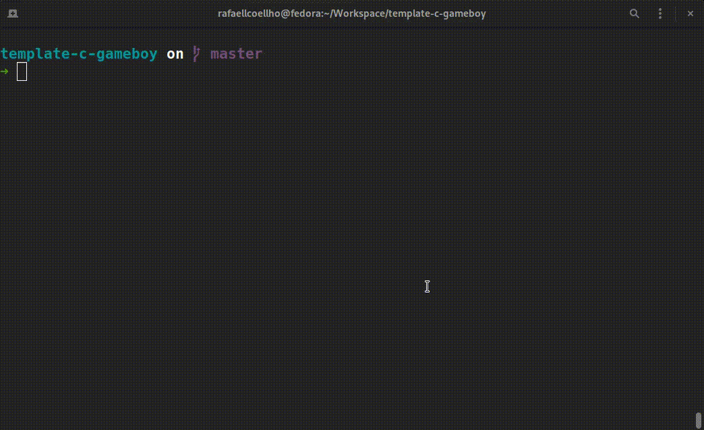

Rodando um hello world para Game Boy clássico usando
[gbdk](https://github.com/gbdk-2020/gbdk-2020).

<p align="center">
    <a href="https://raw.githubusercontent.com/rafaellcoellho/template-c-gameboy/master/terminal.gif">
		
	</a>
</p>

## Setup

Baixar o gbdk:

```bash
$ make baixar_gbdk
```

## Requisitos

Instalar [sameboy](https://sameboy.github.io/) para emular o jogo em desenvolvimento.

Após compilar corretamente, é possível rodar: 

```bash
$ make rodar_jogo
```

